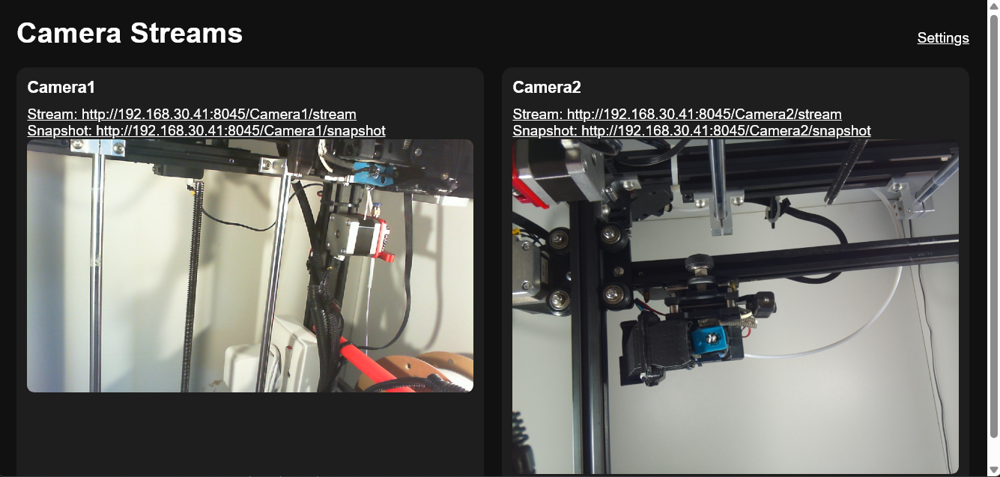
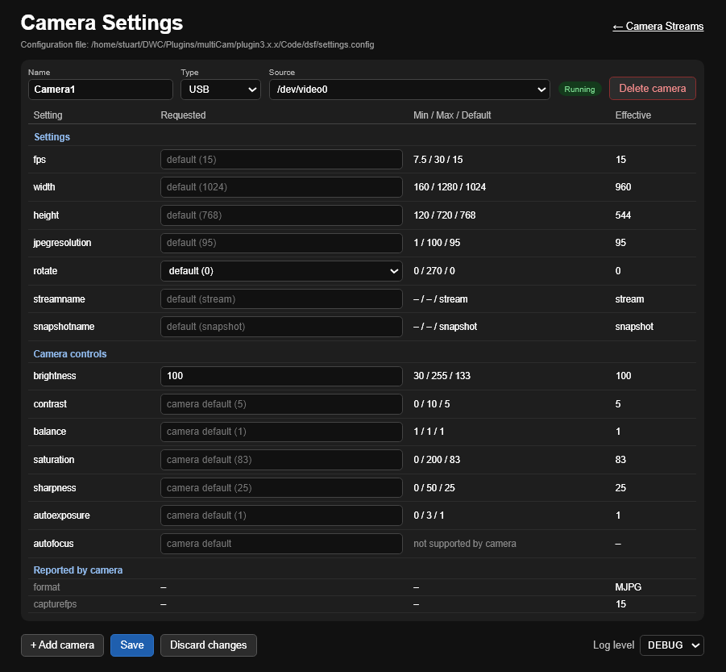

# multiCam

multiCam is a Duet Web Control SBC plugin for viewing and streaming multiple
cameras. It supports USB/V4L2 cameras, Raspberry Pi cameras through Picamera2,
and network cameras that provide an HTTP, HTTPS or RTSP stream.

It has been programmed with efficiency in mind:

- where possible the camera hardware is used for options like brightness, contrast etc.  If these are not handled by the hardware they are ignored
- separate libraries are used for USB, PICAMERA and STREAM (largely pass-through)
- capture and streaming are separated - many designs combine these which can affect latency and throughput
- frame dropping occurs at capture time, so dropped frames are not decoded or sent, saving CPU and bandwidth
- MJPEG streams are sent directly to the browser without re-encoding when no rotation is applied
- resolution and frame rate are automatically adjusted to camera capabilities without forcing expensive conversions
- hardware acceleration is used where available (e.g., 180° rotation on Pi cameras costs no CPU)
- control values are validated and clamped to device limits rather than attempting invalid settings that would fail

Cameras can be viewed from the camera streams page `http://<SBC-IP>:<port>`.
The IP address and port are shown in the logfile - see
[Finding the IP address and port](#finding-the-ip-address-and-port).



## Installation

The plugin is installed using DWC in the normal manner.  **Note that there are multiple libraries that need to be install so please be patient - it could take several minutes**

## Finding the IP address and port

**The IP address and port multiCam is using are written to the logfile
`sys/multiCam/multiCam.log` every time the plugin starts.** Check the logfile
after installing the plugin, and after any restart, to find them. You can
open the logfile from DWC (**Files > System**, folder `multiCam`).

Look for lines like these near the end of startup:

```text
View cameras at http://192.168.1.50:17800
Manage settings at http://192.168.1.50:17800/settings
```

The log also lists the stream and snapshot URL of each camera.

The port can change between restarts when it is set to 0 (the default) or the
configured port is already in use, so check the logfile if a page can no longer
be reached.

## Configuration

All configuration (the port, cameras, their settings and the log level) is
managed from the [settings page](#settings-page). Default values are used the
first time the plugin starts.

**Note:** the settings are saved in `sys/multiCam/settings.config`. This file
is encoded and protected by a checksum - **do not attempt to edit it**. If the
file is changed outside the settings page it will fail the checksum, and the
plugin will replace it with default settings the next time it is read, so all
cameras and settings will be lost. The previous file is kept as
`settings.config.bak`.

### Port

By default (port 0) multiCam picks a free port, starting at 17800 and
searching up to 17899. A free port is also picked if the port you set is
already in use.

The IP address and port in use are written to the logfile
(`sys/multiCam/multiCam.log`) at startup - see
[Finding the IP address and port](#finding-the-ip-address-and-port). The port
in use is also shown on the [settings page](#settings-page), but the first
time the plugin starts you need the logfile to find the address of the
settings page.

To use a fixed port, enter it in the **Port** field on the settings page and
press **Save**. The port must be between 1024 and 65535 and must not conflict
with DWC or other plugins or applications. Set it to 0 (or leave it blank) to
go back to picking a free port. Restart the plugin for a port change to take
effect.

### Settings page

Open `http://<SBC-IP>:<port>/settings`, or follow the link from the camera
streams page.



From the settings page you can:

- **Add** and **delete** cameras.
- Set each camera's **name**, **type** (USB, PICAMERA or STREAM) and
  **source**.
  - For USB and PICAMERA cameras, the source is chosen from a list of the
    cameras detected on the system. The list also shows the current source,
    and which sources are already used by another camera.
  - For STREAM cameras, enter the stream URL.
- Set each camera's [settings and options](#cameras). For each one the page
  shows:
  - **Requested**: the value you set. Leave it blank to use the default.
  - **Min / Max / Default**: the limits and default the camera reports.
  - **Effective**: the value the running camera is actually using, after any
    adjustment by the plugin.
- Set the **port**. The field shows the configured port
  (0 = pick a free port), with the port currently in use beside it. See
  [Port](#port).
- Set the **log level**.

Press **Save** to write the changes, or **Discard changes** to go back to the
saved values. Saved changes take effect when the plugin is restarted; until
then a banner is shown, and the Effective column still shows the values the
cameras are running with.

**Note that the cameras details are display in order of the camera name (alphabetically - case sensitive).  

## Logging

The log level can be `INFO` (the default) or `DEBUG`. The log is written to
`sys/multiCam/multiCam.log`.

The log shows the IP address and port in use, and the URLs of the camera
streams page, the settings page and each camera's stream and snapshot. See
[Finding the IP address and port](#finding-the-ip-address-and-port).

To help identify and choose cameras, the plugin logs at startup:

- the cameras it found on the system, with the minimum, maximum and default
  values of each control;
- the settings requested for each configured camera;
- the settings actually applied, after any adjustment (because some may not be
  supported by the camera or the values are outside the supported bounds).

## Cameras

There are three camera types: USB, PICAMERA and STREAM.

Camera names are used in the web URLs and must be unique.

Each camera has **settings** (resolution, frame rate, rotation etc.) and, for
USB and PICAMERA, **options** (camera controls such as brightness and
contrast). Any you leave blank use the defaults. All values must be numeric,
except `streamname` and `snapshotname`.

## USB

The source of a USB camera is a device of the form `/dev/videoN`.

Many USB cameras create more than one `/dev/video` node. Only nodes that
support video capture are offered on the settings page.

### USB options

Options are camera controls, set through `v4l2-ctl`, so `v4l-utils` must be
installed (the plugin does this).

| Option         | V4L2 control                                                 |
|----------------|--------------------------------------------------------------|
| `brightness`   | `brightness`                                                 |
| `contrast`     | `contrast`                                                   |
| `saturation`   | `saturation`                                                 |
| `sharpness`    | `sharpness`                                                  |
| `balance`      | `white_balance_temperature_auto` / `white_balance_automatic` |
| `autofocus`    | `focus_auto` / `auto_focus`                                  |
| `autoexposure` | `exposure_auto` / `auto_exposure`                            |

- At startup, every control the camera reports is reset to its default. The
  options you configure are then applied on top.
- Values are rounded to whole numbers and limited to the camera's minimum and
  maximum.
- Options the camera does not support are skipped.
- Ranges vary between cameras. For example, brightness may be `-64..64` on one
  camera and `0..255` on another. The settings page shows your camera's ranges.
- `balance` and `autofocus` switch the automatic mode on (1) or off (0).
- `autoexposure` uses the driver's menu values. On many UVC cameras, 1 is
  manual and 3 is automatic (aperture priority).

### USB settings

| Setting          | Default  | Description                                                      |
|------------------|----------|------------------------------------------------------------------|
| `width`          | 1024     | Frame width in pixels.                                           |
| `height`         | 768      | Frame height in pixels.                                          |
| `fps`            | 15       | Frame rate.                                                      |
| `rotate`         | 0        | Clockwise rotation, rounded to the nearest 0, 90, 180 or 270.    |
| `jpegresolution` | 95       | JPEG quality (1-100) used when frames are re-encoded.            |
| `streamname`     | stream   | Name of the stream URL. See [User Interface](#user-interface).   |
| `snapshotname`   | snapshot | Name of the snapshot URL. See [User Interface](#user-interface). |

The plugin checks these values against the formats the camera reports and adjusts them where necessary:

- **Format:** MJPG is requested. If the camera does not offer MJPG, YUYV is
  used, or failing that the first format the camera reports.
- **Resolution:** if `width`×`height` is not supported, the next smaller
  resolution (by area) is used. If there is no smaller one, the next larger one
  is used.
- **Frame rate:** if `fps` is not supported at that resolution, the camera is
  run at the next lower rate. If there is no lower rate, it is run at the next
  higher one, and the extra frames are dropped so the stream still runs at
  `fps`. Dropped frames are not decoded or sent, so they cost little CPU and no
  bandwidth.

For example, for a camera that offers 1920x1080, 1280x720, 640x480 and 320x240:

| Requested `width`×`height` | Used      |
|----------------------------|-----------|
| 1024×768                   | 640×480   |
| 160×120                    | 320×240   |
| 4000×3000                  | 1920×1080 |

And for a resolution that offers 30, 15, 10 and 5 fps:

| Requested `fps` | Camera runs at | Streamed at |
|-----------------|----------------|-------------|
| 20              | 15             | 15          |
| 3               | 5              | 3           |
| 60              | 30             | 30          |

The startup log shows both rates: `--capturefps` is the rate the camera runs
at, and `--fps` is the rate streamed.

If the camera delivers MJPG and `rotate` is 0, frames are sent to the browser
unchanged. This uses very little CPU, and `jpegresolution` has no effect.
Setting any rotation means every frame is decoded, rotated and re-encoded at
`jpegresolution`.

## PICAMERA

Raspberry Pi cameras (CSI ribbon cable) use Picamera2/libcamera. The source is
a zero-based Pi-camera index.

The index counts only Pi cameras; USB cameras are not included in the count.
For example, source `0` selects the first Pi camera even if the system reports
a USB camera first.

### PICAMERA options

Options are passed to libcamera when the camera starts.

| Option         | libcamera control |
|----------------|-------------------|
| `brightness`   | `Brightness`      |
| `contrast`     | `Contrast`        |
| `saturation`   | `Saturation`      |
| `sharpness`    | `Sharpness`       |
| `balance`      | `AwbEnable`       |
| `autofocus`    | `AfMode`          |
| `autoexposure` | `AeEnable`        |

- Values are limited to the control's minimum and maximum, then converted to
  the type the control expects: decimal, whole number or on/off.
- Options the camera does not support are skipped. For example, `autofocus`
  only applies to cameras with a focus motor, such as Camera Module 3.
- Typical ranges:
  - `brightness`: -1.0 to 1.0 (default 0).
  - `contrast`, `saturation` and `sharpness`: 0 upward (default 1).
  - `balance` and `autoexposure`: 1 is on, 0 is off.
  - `autofocus`: 0 is manual, 1 is auto (single), 2 is continuous.
- The settings page shows the exact ranges your camera reports.

### PICAMERA settings

| Setting          | Default  | Description                                                      |
|------------------|----------|------------------------------------------------------------------|
| `width`          | 1024     | Frame width in pixels.                                           |
| `height`         | 768      | Frame height in pixels.                                          |
| `fps`            | 15       | Frame rate.                                                      |
| `rotate`         | 0        | Clockwise rotation, rounded to the nearest 0, 90, 180 or 270.    |
| `jpegresolution` | 95       | JPEG quality (1-100).                                            |
| `streamname`     | stream   | Name of the stream URL. See [User Interface](#user-interface).   |
| `snapshotname`   | snapshot | Name of the snapshot URL. See [User Interface](#user-interface). |

The plugin checks these values against the camera's sensor modes and adjusts
them where necessary:

- **Resolution:** sensor modes are the sizes the sensor reads out. The camera
  scales its output from a sensor mode, so any `width`×`height` that fits
  inside at least one sensor mode is used as requested. If it is larger than
  every sensor mode, the next smaller mode (by area) is used, or if there is no
  smaller one, the next larger one.
- **Frame rate:** the limit is the highest maximum rate among the sensor modes
  large enough for `width`×`height`. Any rate up to that limit is accepted.
  Higher values are reduced to it.

Frames are always captured as RGB and encoded to JPEG at `jpegresolution`.
A rotation of 180 is done by the camera hardware and costs no CPU. Rotations of
90 and 270 are done in software.

## STREAM

The source of a network camera is a URL starting with `http://`, `https://` or
`rtsp://`, for example `http://192.168.30.31:8081` or
`rtsp://192.168.30.32:554/stream1`.

Streams use OpenCV's automatic backend selection, usually FFmpeg.

- RTSP streams are forced to use TCP, which avoids corrupted frames.
- HTTP and HTTPS streams reconnect automatically.
- If no frames arrive for 5 seconds, the stream is reopened.

### STREAM settings

| Setting          | Default  | Description                                                      |
|------------------|----------|------------------------------------------------------------------|
| `fps`            | 15       | Maximum frame rate served.                                       |
| `rotate`         | 0        | Clockwise rotation, rounded to the nearest 0, 90, 180 or 270.    |
| `jpegresolution` | 95       | JPEG quality (1-100) used when frames are re-encoded.            |
| `streamname`     | stream   | Name of the stream URL. See [User Interface](#user-interface).   |
| `snapshotname`   | snapshot | Name of the snapshot URL. See [User Interface](#user-interface). |

A stream is passed through as the source delivers it. `width` and `height`
are not used; the source's resolution is used.

`fps` is an upper limit. It does not change the rate the source sends:

- If `fps` is at or above the source's rate, every frame is served.
- If `fps` is below the source's rate, frames are dropped to reach `fps`. Dropped
  frames are still received, and RTSP frames are also decoded, so they still
  cost bandwidth and some CPU.
- To avoid uneven motion when reducing the rate, use an even fraction of the
  source's rate, for example 15 for a 30 fps camera.

If an HTTP/HTTPS source delivers MJPEG and `rotate` is 0, the source's JPEG
frames are sent unchanged, and `jpegresolution` has no effect. RTSP streams,
non-MJPEG sources and rotated streams are decoded and re-encoded at
`jpegresolution`.

## User Interface

Open `http://<SBC-IP>:<port>/` to view the configured cameras, and
`http://<SBC-IP>:<port>/settings` to change them. Each camera also has these
endpoints, where `<camera-name>` is URL-encoded when necessary:

```text
http://<SBC-IP>:<port>/<camera-name>/<streamname>
http://<SBC-IP>:<port>/<camera-name>/<snapshotname>
```

`<streamname>` and `<snapshotname>` default to `stream` and `snapshot`, and
can be changed for each camera on the settings page.

The names may only contain letters, digits, `-`, `_` and `~`, and must be
different from each other. An invalid name is replaced by its default, with a
warning in the log.
